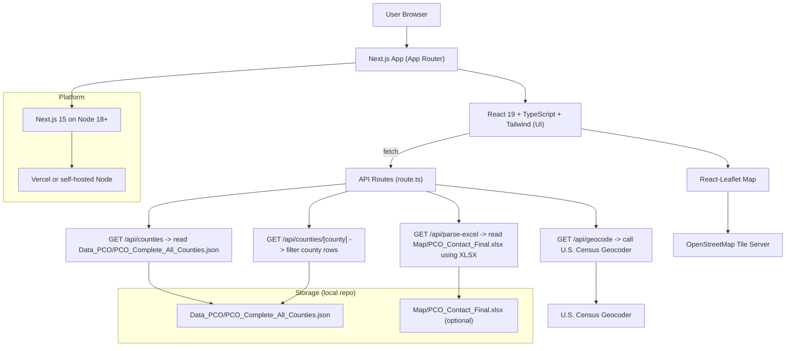
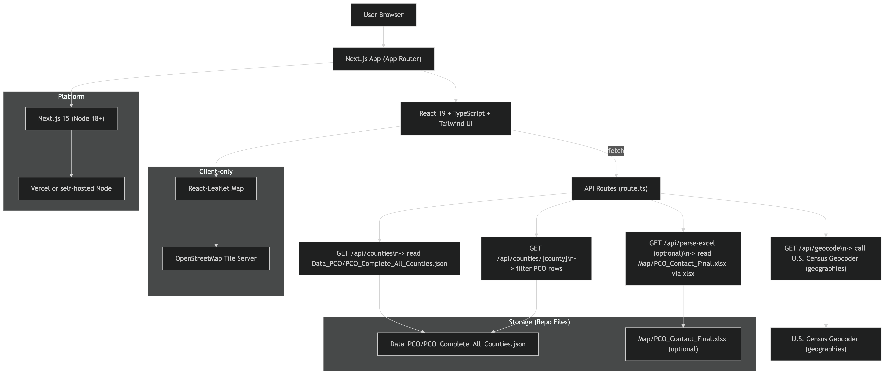
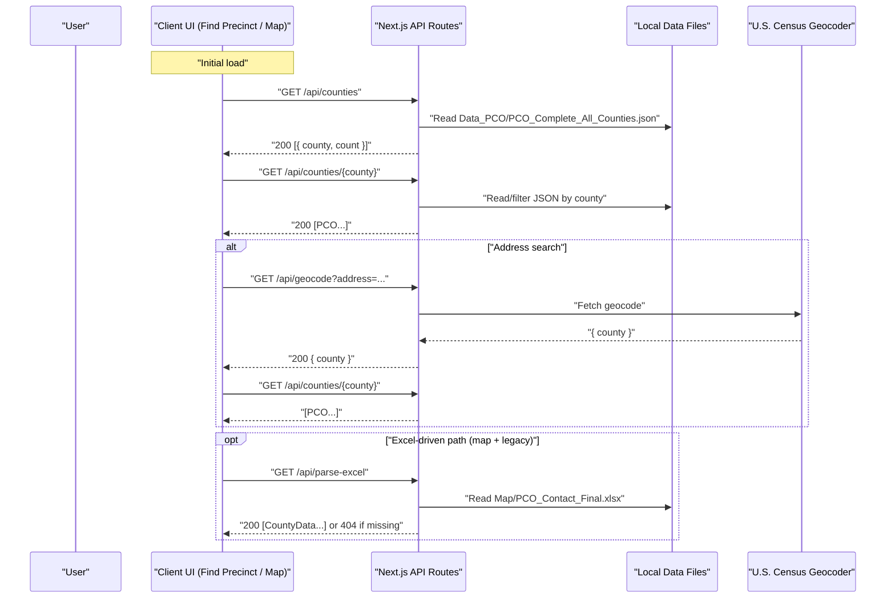
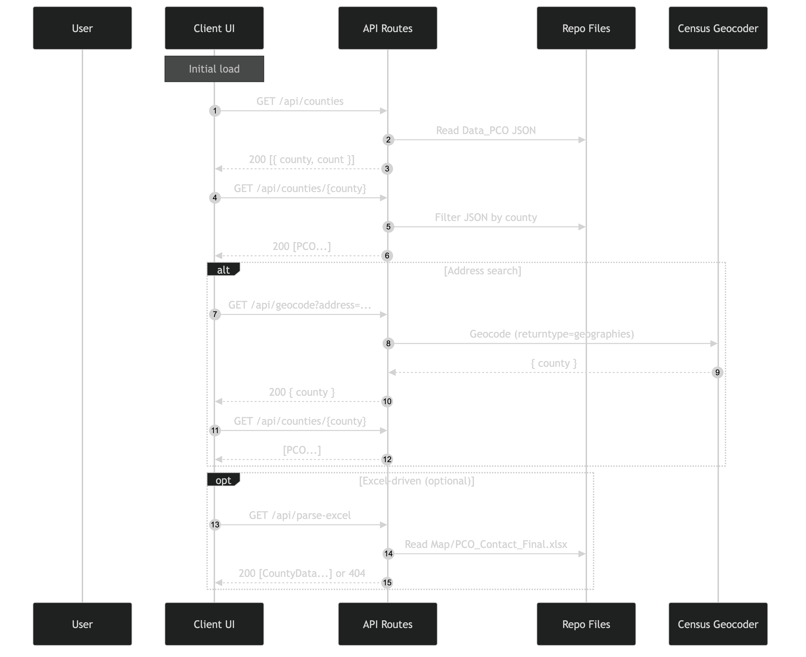
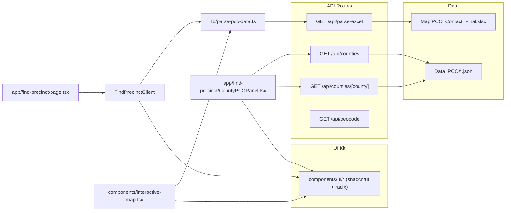
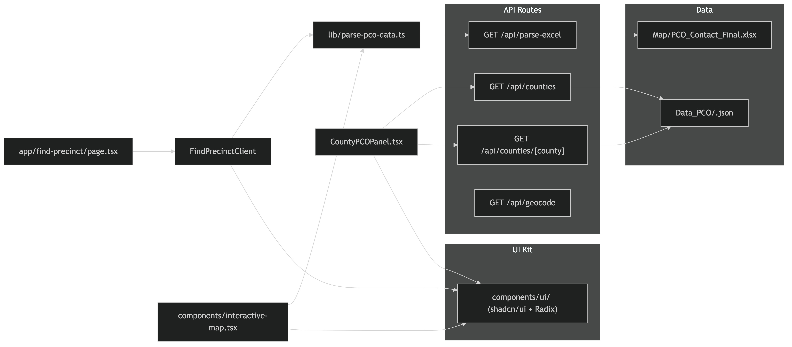

### Technical Architecture — TVW-PCO

Version: 1.0.0 (2025-08-09)

### 1) Overview
- **Purpose**: Public website to educate Washington State residents about PCOs, surface county-level PCO directories, and help users find precinct-related information.
- **Core flows**:
  - County PCO directory from prebuilt JSON in `Data_PCO/PCO_Complete_All_Counties.json`.
  - Optional interactive map and Excel ingestion via `/api/parse-excel` when `Map/PCO_Contact_Final.xlsx` is present.
  - Address-to-county lookup via the U.S. Census geocoding service.

### 2) System Context

Rendered image (4K PNG):

### 3) Platform Decisions
- **Framework**: Next.js 15 (App Router), Node 18+ runtime.
- **Language**: TypeScript.
- **UI**: React 19, Tailwind CSS, shadcn/ui + Radix primitives.
- **Mapping**: React-Leaflet (client-only via dynamic imports) with OpenStreetMap tiles.
- **Data storage**: File-based JSON within repo. Optional Excel file for authoring convenience.
- **Hosting**: Vercel recommended; also works on self-hosted Node.
- **Build settings** (`next.config.mjs`): ESLint and TypeScript errors ignored during builds; images unoptimized (acceptable for MVP, revisit for production).
- **Dependencies note**: React 19 with `vaul` currently requires `--legacy-peer-deps` installation. Options:
  - Short-term: Continue with React 19 and `--legacy-peer-deps`.
  - Safer: Downgrade to React 18 or replace/upgrade `vaul` when React 19 compatible.

### 4) Data Model
- **PCO (canonical JSON shape)**
  - Source: `Data_PCO/PCO_Complete_All_Counties.json`
  - Fields: `name`, `party?`, `precinct?`, `phone?`, `email?`, `address?`.
- **CountyData (Excel-driven, optional path)**
  - Source: `Map/PCO_Contact_Final.xlsx` parsed by `/api/parse-excel`.
  - Fields: `county`, `precinct?`, `party ('Republican'|'Democratic'|'Unknown')`, `pcoName`, `phone`, `email`, `coordinates? (lat,lng)`.

### 5) APIs
- **GET `/api/counties`**
  - Reads `Data_PCO/PCO_Complete_All_Counties.json` and returns `[{ county, count }]`.
  - Errors: `500` if file read fails.
- **GET `/api/counties/[county]`**
  - Filters the same JSON by county; returns `PCO[]`.
  - Errors: `404` if county not found; `500` on error.
- **GET `/api/geocode?address=...`**
  - Calls U.S. Census geocoder; returns `{ county }`.
  - Errors: `400` if address missing; `404` if not found; `500` on fetch error.
- **GET `/api/parse-excel`** (optional)
  - Reads `Map/PCO_Contact_Final.xlsx` using `xlsx` and returns `CountyData[]`.
  - Errors: `404` if file missing; `500` on parse error.

Sequence (typical request flow)

Rendered image (4K PNG):

### 6) Client Components and Data Flow
- **County Directory (`app/find-precinct/CountyPCOPanel.tsx`)**
  - Loads `GET /api/counties` on mount, then fetches `GET /api/counties/{county}` on selection.
  - Client-side search filters results for responsiveness.
- **Interactive Map (`components/interactive-map.tsx`)**
  - Loads via `parsePCOExcelFile()` → `GET /api/parse-excel`; groups by county; renders React-Leaflet markers with party-based coloration.
  - If Excel missing, shows a friendly error card.
- **Find Precinct client (`app/find-precinct/find-precinct-client.tsx`)**
  - Currently oriented around Excel-driven data; can be extended to use geocoding flow.

Dependencies diagram

Rendered image (4K PNG):

### 7) Integrations
- **U.S. Census Geocoder**: used by `/api/geocode` to map an address to a county. No API key required. Add rate limiting and basic retry/caching on server if traffic grows.
- **OpenStreetMap Tiles**: used by React-Leaflet. Respect tile usage policies; consider a managed tile provider for production SLAs.

### 8) Data Sources and Pipeline
- **Canonical runtime dataset**: `Data_PCO/PCO_Complete_All_Counties.json` (consumed by `/api/counties*`).
- **Authoring path (optional)**: `Map/PCO_Contact_Final.xlsx` parsed by `/api/parse-excel` for the map and experiments.
- **Conversion script**: `process_pco_data.py` consolidates CSV exports into a flat JSON; see `PCO_DATA_SETUP.md` for authoring steps. Consider integrating this into CI to produce/update the canonical JSON.

### 9) Security & Privacy
- No server-side database. Transient processing of requests only.
- PCO contact details assumed public/approved; establish a consent and redaction policy.
- Validate/sanitize inputs in API routes; consider per-IP throttling for `/api/geocode`.

### 10) Performance
- Client-side filtering avoids per-keystroke requests.
- React-Leaflet dynamically imported to avoid SSR costs.
- If data volume increases, consider server pagination for county PCO lists.

### 11) Accessibility
- UI follows accessible patterns (Radix primitives, keyboard navigation, contrast). Provide non-map fallbacks where relevant.

### 12) CI/CD
- Install step may require `npm install --legacy-peer-deps` until React 19 peer issues are resolved.
- Lint/typecheck are currently ignored during build (per `next.config.mjs`); tighten for production.
- Build and deploy with Vercel previews; main → production.

### 13) Deployment
- Recommended: Vercel (auto-detects Next.js). Alternative: self-hosted Node.
- Ensure `Data_PCO/PCO_Complete_All_Counties.json` is present and valid in deployments.
- Decide whether to include `Map/PCO_Contact_Final.xlsx` in production or gate Excel-driven features.

### 14) Operational Notes (Observed)
- Dev server started successfully:
  - Local: `http://localhost:3000`
  - Network: `http://192.168.1.162:3000`
- `/api/parse-excel` returned `404` because `Map/PCO_Contact_Final.xlsx` was not found. Either place the file or temporarily disable Excel-driven features.
- `GET /placeholder.svg?...` returned `404`; verify any placeholder asset usage in the UI.

### 15) Runbook
- Install deps (current): `npm install --legacy-peer-deps`
- Dev: `npm run dev`
- Build: `npm run build`
- Start: `npm run start`

### 16) Risks & Future Work
- Dependency drift with React 19 and some UI libs (e.g., `vaul`).
- Large JSON may impact cold starts/transfer; consider chunking or server pagination if needed.
- Unify data sources: prefer a build-time transform from Excel/CSV → canonical JSON.
- Add tests for API routes and data normalization; integrate a schema validator for `Data_PCO`.

### 17) Change Log
- 1.0.0 (2025-08-09): Initial architecture document added with diagrams, platform decisions, integrations, and operational notes.

